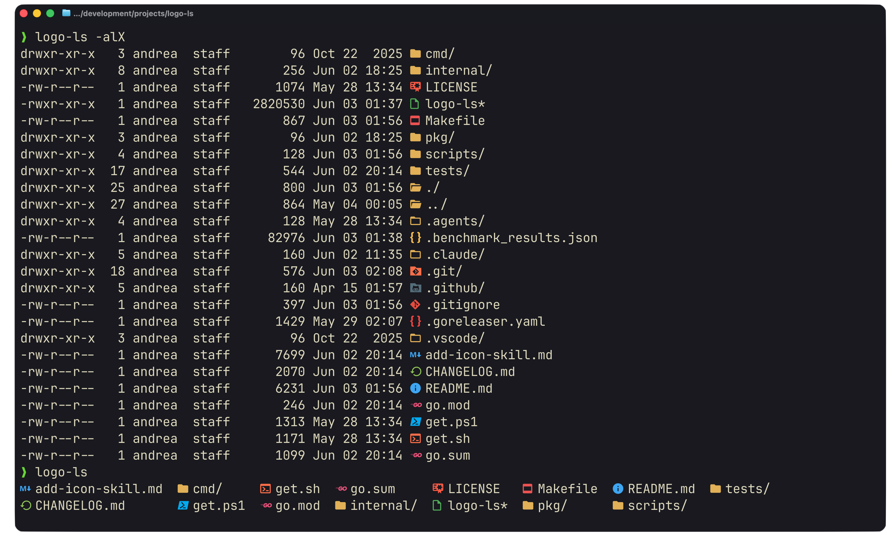
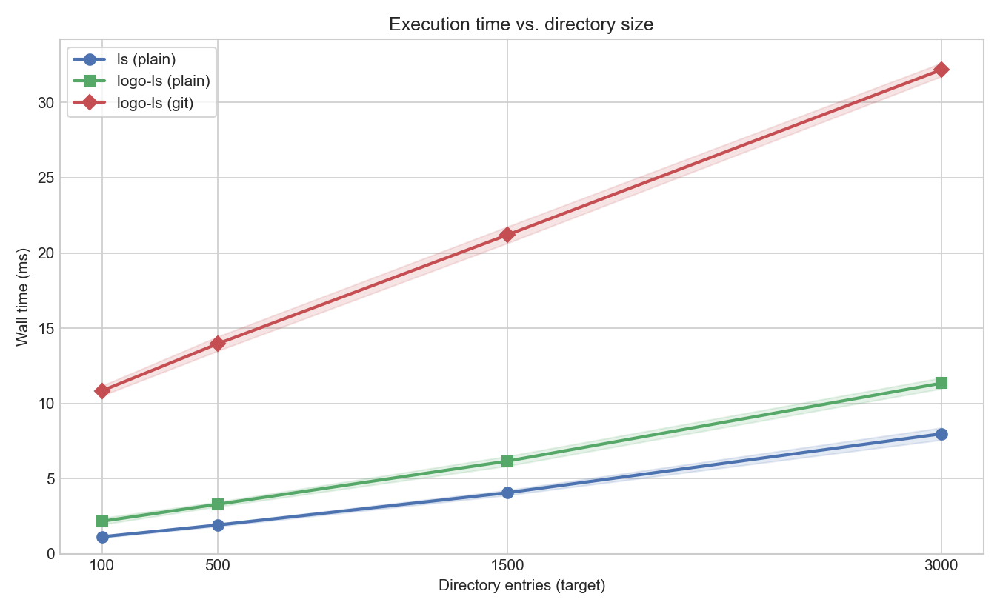

<div align="center">

</div>

<h1 align="center">
    logo-ls
</h1>

A fork of [logo-ls](https://github.com/Yash-Handa/logo-ls) which I ended up maintaining since the original repository went unmaintained some years ago. Contributions are welcome (see [CONTRIBUTING.md](CONTRIBUTING.md)).

---

## Installation

### Prerequisites

- Ensure your terminal is using a Nerd Font to see the icons properly. You can download your favourite Nerd Font from [here](https://www.nerdfonts.com/font-downloads). Some terminal emulators such as [Ghostty](https://ghostty.org) come with built in support for Nerd Fonts, so you don't have to worry about it.
- The command will be installed as `logo-ls`, you can optionally set an alias for `ls` to `logo-ls` if you want to use it as a drop in replacement for `ls`.

### Arch Linux

Install the logo-ls [AUR package](https://aur.archlinux.org/packages/logo-ls).

```bash
yay -S logo-ls
```

### Homebrew (tap)

```bash
brew install canta2899/homebrew-tap/logo-ls
```

### Binary Release (Linux/OSX/Windows)

#### Linux/OSX

```bash
curl -L https://raw.githubusercontent.com/canta2899/logo-ls/refs/heads/main/get.sh | sh
```

#### Windows

```powershell
Set-ExecutionPolicy -Scope Process -ExecutionPolicy Bypass
irm https://raw.githubusercontent.com/canta2899/logo-ls/main/get.ps1 | iex
```

Optionally, you can set these variables:

- `LOGO_LS_INSTALL_DIR` (to specify a different installation directory, defaults to `~/.local/bin`)
- `LOGO_LS_VERSION` to specify a version (defaults to the latest one)

#### Manual Install

You can download the binary for your platform from the [releases page](https://github.com/canta2899/logo-ls/releases/).

### Build from source

Clone the repository

```bash
git clone https://github.com/canta2899/logo-ls
```

Build the binary, which is outputted to the root directory of the repository:

```bash
make logo-ls
```
---

## Icons

`logo-ls` comes with a huge built in set of icons for common file types and directories. However, you can also add your own custom icons or override existing ones with the built-in override system.

You can drop a YAML file in either of the following locations:

- `$XDG_CONFIG_HOME/logo-ls/logo-ls-overrides.yaml` (defaults to `~/.config/logo-ls/logo-ls-overrides.yaml`)
- `~/.logo-ls-overrides.yaml`

The first existing file wins. The file is read **once at startup** and merged with the built-in icon set, so it does not impact per-directory listing speed. If the file is missing or empty the loader just skips it, if it cannot be parsed `logo-ls` prints a single warning and continues with built-in icons only.

#### Schema

Each entry can set a `glyph`, a `color`, or both. Whichever field you leave out keeps the built-in value for that match, so you can just recolor an existing icon, swap only its glyph, or define a brand-new icon by setting both.

```yaml
extensions:        # matched by file extension (without the leading dot)
  rs:
    glyph: "U+E7A8"    # full override: new glyph and new color
    color: "#dea584"
  go:
    color: "#ff5555"   # color-only: keep the built-in Go glyph, just recolor it
  py:
    glyph: "0xE606"    # glyph-only: keep the built-in Python color

files:             # matched by full file name (case-insensitive)
  .envrc:
    glyph: "U+E60B"
    color: "#ecd53f"

directories:       # matched by full directory name (case-insensitive)
  myproject:
    color: "#42a5f5" # recolor a directory without changing its glyph

sub_extensions:    # matched by "<last-segment><ext>"
  d.ts:
    glyph: "U+E628"
    color: "#3178c6"
```

Glyphs can be written as `U+XXXX` or `0xXXXX` (parsed as hex codepoints) or as literal strings. Colors are `#RRGGBB` (or the shorthand `#RGB`). User entries take priority over the built-in icons. Glyphs can also be emojis or any other unicode character, but Nerd Font glyphs are recommended for the best visual consistency.

#### Flags

Two flags control the override loader:

- `--no-override` skips override loading entirely and forces built-in icons only.
- `--override-file <path>` loads overrides from an explicit YAML path instead of the default discovery locations.

If neither flag is passed the default discovery paths above are used.

---

## Benchmarks

The repo ships with a small benchmark harness that compares `logo-ls` (plain and `-D` git-status modes) against the system `ls`, across directories of increasing size. It uses [`hyperfine`](https://github.com/sharkdp/hyperfine) under the hood and is driven by two python scripts.

```sh
make benchmark       # builds logo-ls, runs hyperfine, writes .benchmark_results.json
make benchmark-plot  # renders benchmark.png from the saved results
```



On my machine, `logo-ls` is slightly slower than `/bin/ls` (imperceptibly so), and `-D` git-status mode is bottlenecked by `git` itself, but it all still lands comfortably in the imperceptible range.

