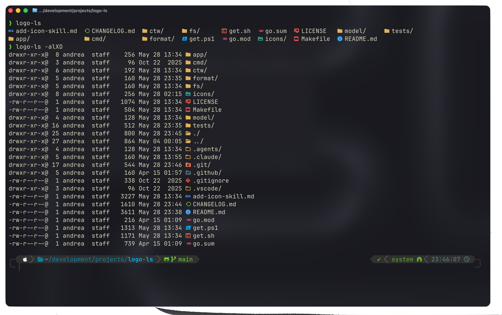

<div align="center">

</div>

<h1 align="center">
    logo-ls
</h1>

A fork of [logo-ls](https://github.com/Yash-Handa/logo-ls) which I ended up maintaining since the original repository went unmaintained some years ago. Feel free to open an issue or a pull request if you have any questions or want to contribute. If you want to add icons, check the [Adding Icons](#adding-icons) section below for instructions on how to do so.

---

## Installation

### Prerequisites

- Ensure your terminal is using a Nerd Font to see the icons properly. You can download your preferred Nerd Font from [here](https://www.nerdfonts.com/font-downloads). Some terminal emulators such as [Ghostty](https://ghostty.org) come with built in support for Nerd Fonts, so you don't have to worry about it.

### Linux and OSX

The following script downloads the latest release of logo-ls to `~/.local/bin` and can be used to install or update logo-ls.

```bash
curl -L https://raw.githubusercontent.com/canta2899/logo-ls/refs/heads/main/get.sh | sh
```

Optionally, you can set the variables `LOGO_LS_INSTALL_DIR` and/or `LOGO_LS_VERSION` to specify a custom installation directory and/or version to install.

If you want to alias `logo-ls` to `ls` you can add the following line to your shell configuration file:

```bash
alias ls="logo-ls"
```

### Windows

Windows installation works exactly the same as Linux and OSX, you just have to run the following command in powershell:

```powershell
Set-ExecutionPolicy -Scope Process -ExecutionPolicy Bypass
irm https://raw.githubusercontent.com/canta2899/logo-ls/main/get.ps1 | iex
```

And, optionally, you can set the alias for `ls` to `logo-ls` by running the following command in powershell:

```powershell
Set-Alias ls logo-ls
```

### Manual installation

You can manually download the binary for your platform from the [releases page](https://github.com/canta2899/logo-ls/releases/). Then, you have to extract the archive, check the integrity of the file and move the executable binary of logo-ls to a directory in your `$PATH` (or symlink it).

### Build from source

Clone the repository

```bash
git clone https://github.com/canta2899/logo-ls
```

Build the binary, which is outputted to the root directory of the repository:

```bash
make logo-ls
```

Then you can move the binary to a directory in your `$PATH` (or symlink it).

---

## Adding Icons

If you use any coding agent (OpenCode, Gemini CLI, Claude Code, etc.) there's a built in skill called `/add-icon` which you can use to let your agent do the job for you. If you want to do it manually, you can read the skill instructions inside `.agents/skills/add-icon/SKILL.md`.

> **Note for Windows contributors:** the skill file lives at `add-icon-skill.md` in the repo root, and the paths under `.agents/skills/add-icon/SKILL.md` and `.claude/skills/add-icon/SKILL.md` are symlinks to it. Git for Windows does not create real symlinks by default, so these may be checked out as plain text files containing the link target. To get working symlinks, enable Developer Mode (or run as admin) and set `git config --global core.symlinks true` before cloning.

